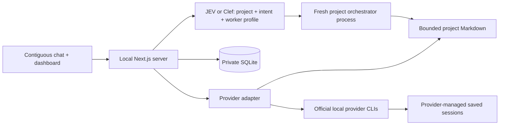

# crouter

**One chat for all your projects and AI coding tools.** Describe what you need in a single conversation: crouter routes the request to the right project, selects an enabled provider, model and effort, and keeps tasks, results and resumable sessions organized in one dashboard. Generic requests go to the General workspace. You can choose a project explicitly and optionally balance new work against remaining subscription usage.

The intent is to stop juggling separate chats for every repository and CLI while keeping project context small, local and tied to its project. Each turn uses a fresh orchestrator; project Markdown stores task state, and the official Codex, Claude, Grok, Antigravity and Muse CLIs retain their worker sessions. The shared chat is a display, so each request must stand on its own. Workers currently produce read-only plans and reviews; implementation happens in the official interactive CLI.

MIT-licensed and built with Next.js, React, TypeScript, Tailwind CSS and SQLite. JEV or Cloudflare Clef handles routing; provider authentication stays with your existing host CLIs.

## Quick start

Use Node.js **22.13+** (Node 24 recommended) and npm on macOS or Linux. SQLite is provided by Node, so no database server or native SQLite package is needed. The app is designed for a single trusted user on a local machine, not a public server or serverless platform.

```sh
npm ci
cp .env.example .env.local
```

Edit `.env.local` locally. JEV is the default classifier: set `TYPESAFE_API_KEY` to your TypeSafe key. To use Cloudflare Clef instead, set:

```dotenv
CROUTER_ROUTER=clef
CLOUDFLARE_API_TOKEN=
CLOUDFLARE_ACCOUNT_ID=
CLEF_MODEL=clef
```

Fill in the token and account ID privately. Cloudflare's [Workers AI REST setup](https://developers.cloudflare.com/workers-ai/get-started/rest-api/) explains how to obtain them. `CLEF_MODEL` accepts `clef` or `clef-flash`. Set `CROUTER_ROUTER=jev` to switch back. Restart the server after editing `.env.local`; only the selected backend is contacted, with no automatic fallback. Keep all credentials server-only; never add a `NEXT_PUBLIC_` prefix. For real use, put runtime data outside your source repositories:

```sh
# Run in your own terminal. This directory is private and must not be committed.
export CROUTER_DATA_DIR="$HOME/.local/share/crouter"
npm run dev
```

Open [http://127.0.0.1:3000](http://127.0.0.1:3000). You can send generic questions, writing, research and other requests immediately using the built-in **General** workspace; no project registration is required. Automatic routing chooses General when the request is unrelated to a registered project. Select **General** in the composer to make the destination explicit. Each General task runs in its own private OS temporary directory outside the app checkout. The directory is reused for that task’s resumed session, while task Markdown and results remain in `CROUTER_DATA_DIR/general/.router-agent/`. Workers use the same read-only permissions and queued-task Run flow as project work. General does not count toward the 20-project limit and cannot be edited or removed.

For project work, click **Add project**, enter a name, a path to an existing project folder on the host, and a description of what the project is about. Optionally add aliases. Absolute paths, `~/` paths, and relative paths are accepted; relative paths start at the server’s working directory, or `CROUTER_PROJECTS_DIR` when set. The dialog previews the canonical host path before registration. Registration creates `.router-agent/` in that folder and adds `/.router-agent/` to its `.gitignore`. Existing tracked agent state is rejected. Names and aliases must be unique; the registry holds at most 20 projects.

Describe the work naturally. JEV can match it to a project’s context, or you can select a project in the message composer. Naming the project also works:

- `What is the status of Atlas?`
- `Create a task for Atlas: review the login flow and outline edge cases.`

The composer defaults to **Automatic model & effort**. The selected classifier chooses a supported host profile using the current task and enabled host models. Remaining usage is considered when you opt in below. A provider override restricts the choice to that provider. Each task saves its model and effort and uses them on new and resumed runs. ChatGPT uses Codex; `agy` is Antigravity CLI, the Google CLI integration. Open a queued task to start its worker, inspect the result, or resume its saved provider session. Chat history is purely a local display; asking “do that again” will not retrieve previous chat context.

## Routing preferences

Open **Host & usage** to search the model list across discovered CLIs and enable or disable each model for new tasks. Disabling a model removes every effort profile for that model, including when a provider is selected in the composer. Choices are keyed by both CLI and model ID, so the same model served by different CLIs can be toggled independently. No models are selected by default. Select the models you want to use; selections persist across refreshes and restarts. Newly discovered models stay unselected. Older exclusion-based preferences migrate to an empty selection; usage settings are retained. Search, provider filters, a selected-only view, and Select visible / Clear visible actions make larger catalogs easier to navigate.

**Route based on remaining usage** is an opt-in toggle, initially off. When on, each eligible model needs fresh quota data and at least the configured **Minimum remaining usage** in every reported active window, including 5-hour and weekly limits. The default reserve is **20%**, and it applies to all new tasks, so large tasks cannot bypass it through a higher effort choice. Requests are balanced across suitable models using remaining allowance above the reserve and time until reset. Models with spare allowance that resets sooner receive more weight. Each request samples a preferred model from those weights; JEV/Clef can choose another model when task capabilities or a matching rule require it. Models sharing an identical quota pool split its weight, and extra effort profiles do not increase it. The most restrictive applicable window governs. Without a reset time or window duration, balancing uses the remaining percentage alone. Missing, stale, expired, or unsupported usage excludes a model in this mode. If none qualify, no task is created; adjust preferences or wait for allowance to reset. This is a remaining-allowance guard, not a prediction of the task’s token cost.

When the opt-in is off, quota is displayed locally but omitted from the classifier’s payload and eligibility decisions. Preferences live in `routing.json` inside `CROUTER_DATA_DIR` (default `.crouter/routing.json`), shared across its tailnet devices; they do not modify CLI configuration or source files. Existing task model/effort/session bindings are retained. Preferences and usage eligibility are checked again after classification. A changed rule or selection requires retrying the turn. Metadata is refreshed at the next reported reset, and a passed reset cannot qualify until fresh usage confirms the allowance.

In **Host & usage → Routing rules**, add general routing instructions and ordered “prefer this model when…” rules, then select **Save rules**. For example, prefer a lightweight model for documentation and a stronger model for architecture. Matching rules take priority over usage balancing; the first matching rule wins a conflict. Rules only apply to enabled, eligible host models and cannot override project or intent routing.

You can also edit the same private `routing.json` file directly; edits are read on the next request without a restart. The first UI save creates it, and existing SQLite preferences migrate automatically. This example uses placeholder model IDs—replace them with exact IDs from your host model list:

```json
{
  "enabledModels": [
    { "provider": "codex", "model": "your-light-model" },
    { "provider": "claude", "model": "your-reasoning-model" }
  ],
  "usageAware": true,
  "minRemainingPercent": 20,
  "instructions": "Prefer low effort for simple fixes and higher effort for complex analysis.",
  "rules": [
    {
      "provider": "codex",
      "model": "your-light-model",
      "when": "Small UI changes, documentation, or straightforward tests"
    },
    {
      "provider": "claude",
      "model": "your-reasoning-model",
      "when": "Architecture or complex debugging"
    }
  ]
}
```

The file accepts up to 16 rules (500 characters each) and 2,000 characters of general instructions. Invalid files block routing and are preserved for correction. UI saves use an atomic write with private permissions. Routing guidance is submitted to the configured JEV/Clef service; keep it free of secrets. Codex, Claude, Antigravity, Grok and Muse have quota adapters. Grok reads account billing through ACP or its CLI billing API; Muse reads subscription windows using the CLI’s saved device login. Missing credentials, inaccessible Keychain items, unsupported accounts or omitted quota data show a specific reason and do not qualify for usage-aware routing.

## Existing host CLIs

Crouter discovers the CLIs and saved accounts already present on its host. It does not install clients, initiate login, or configure provider accounts. Trusted executable overrides are available in `.env.example`; `CODEX_HOME` and `CLAUDE_CONFIG_DIR` are respected. Missing clients and unavailable account data are reported in **Host & usage**.

The adapters use current official CLI contracts:

- **Codex:** `codex exec --json`, `thread.started` session IDs, and `codex exec … resume <id> -`. Read-only sandbox and `never` approval policy apply on every new/resumed run. User configuration and execpolicy rules are skipped; saved CLI authentication is still used. See [non-interactive mode](https://learn.chatgpt.com/docs/non-interactive-mode).
- **Claude:** `claude -p --output-format stream-json --verbose`, `session_id`, and `--resume <id>`. Uses `--safe-mode`, no user/project/local settings sources, empty strict MCP configuration, and only `Read,Glob,Grep` tools with `dontAsk`. See [programmatic CLI usage](https://code.claude.com/docs/en/headless) and [CLI reference](https://code.claude.com/docs/en/cli-reference). Bare mode is deliberately not used because current Claude documentation says it requires API credentials rather than the subscription login.

Use recent CLI versions supporting these flags; incompatible versions fail closed. No bypass-permissions flag is used. Workers are **read-only planning and review agents** in this first version. “Done” means that worker turn produced its plan/findings, not that code was implemented. To implement a plan, open the saved session in the official interactive CLI in the correct project folder and explicitly review its tool permissions there. That separate interaction is outside the web app's approval system.

## Offline synthetic demo

The demo contains fabricated projects and task content. It makes no classifier calls and never starts a provider CLI. Run against a separate empty data directory:

```sh
CROUTER_DATA_DIR=/tmp/crouter-demo npm run demo
CROUTER_DATA_DIR=/tmp/crouter-demo CROUTER_DEMO=1 npm run dev
```

Remove `CROUTER_DEMO=1` and use a different data directory for real use. Demo routing is a deliberately simple name match, clearly labeled in the UI; production never silently falls back to it.

## Providers, usage, and private hosting

The main chat reports completion and failure of crouter worker turns across all projects. The conversation uses assistant-ui’s open-source external-store runtime without hosted cloud persistence. Codex quotas, aggregate account usage, and available models come from its app-server. Claude models come from its SDK metadata handshake; quotas use the existing account’s OAuth usage endpoint, following Omarchy’s collector. No model inference is performed by these reads. Unsupported subscription metrics remain unavailable. Grok uses its official local ACP client. Antigravity (`agy`) and Muse Code use an additional macOS filesystem barrier and fail closed on other platforms. ChatGPT is the Codex adapter. See [provider details](docs/providers.md) and [private Tailscale Serve setup](docs/tailscale.md).

## Architecture and data boundaries



**Global SQLite:** project ID/name/path/aliases/description, at most 200 display messages, short-lived single-use approval references, expiring operation leases. Project descriptions are owner-provided setup metadata; it stores no task knowledge or generated project summaries. Dashboard task content is read from project files on demand. The default private data directory is `.crouter/`; prefer the external directory shown above.

**Private routing file:** `routing.json` stores model selections, usage opt-in, reserve percentage, general instructions, and ordered model rules. SQLite retains legacy preferences only for migration. Back up the routing file alongside the database.

**Routing classifier:** a fresh server-side request with three `choice` questions for project, intent, and an advertised worker profile. JEV uses `POST https://api.typesafe.ai/v1/systemone`, `Authorization: Bearer $TYPESAFE_API_KEY`, and `model: jev-latest`. Clef uses the official Workers AI endpoint `POST https://api.cloudflare.com/client/v4/accounts/{account_id}/ai/run/@cf/cloudflare/{model}`, `Authorization: Bearer $CLOUDFLARE_API_TOKEN`, and `model: clef` or `clef-flash`; the successful Cloudflare `result` envelope is validated before use. Only the current turn, registry IDs/names/aliases, bounded project descriptions, an optional explicitly selected project, and enabled model/effort profiles are submitted. With usage-aware routing enabled, eligible profiles include normalized fresh quota windows; below-reserve, stale, and unknown allowance are excluded before classification. The host always filters unavailable clients and disabled models. No paths, chat history, task files, decisions, or session IDs are included. Both backends use the same allowed project, intent, and worker profile sets. Automatically classified projects and intents require confidence of at least 0.75; an explicitly selected registered project fixes the target independently of project confidence. a worker decision accepts the top valid advertised profile with a positive probability, because equally suitable models can split that probability. The worker score is returned separately from project/intent confidence. Missing credentials, network errors, invalid output, unknown intents, or ambiguity fail before any project work. See the [official TypeSafe quick start](https://docs.typesafe.ai/introduction/quickstart) and [Cloudflare Clef docs](https://developers.cloudflare.com/workers-ai/models/clef/).

**Project orchestrators:** ordinary short-lived Node processes with no model session, network calls, or retained context. A process reads only the small fixed state files and, when needed, one requested task file; handles status/task creation/state updates; writes Markdown atomically; and exits. No project orchestrator memory accumulates between turns. They do not recursively scan repositories or load transcripts.

```text
project/
  .router-agent/              # private; ignored in that project's Git repository
    tasks.md                 # JSON metadata in Markdown: status, provider, model, effort, session IDs
    decisions.md             # short, rolling operational decisions
    agents.md                # concise provider policy
    tasks/T-xxxxxxxx.md       # individual request and bounded latest result
    archive/                 # archived task files; not read during orchestration
```

There are at most **40 active tasks** per project; `tasks.md` is at most **32 KiB**; `agents.md`, `decisions.md`, and each task file are at most **8 KiB**. Results are capped, and operational decisions retain only the latest 24 entries. Oversized or malformed state fails rather than being silently loaded. Archive finished tasks to free space. Each task has its own provider/model/effort/session binding; there is no automatic provider switching or `--last` session guessing.

**Workers:** each turn starts the official CLI process, resuming the recorded session when present. Fresh process execution and persistent provider conversations are separate lifecycles. The session identifier is saved immediately when observed, before the final response. Stderr/tool event bodies are not exposed in the UI; only bounded final text is persisted. Shell interpolation is never used. Workers receive a small environment allowlist, excluding TypeSafe, Cloudflare, and other API-key variables. Provider-managed sessions live wherever their official CLI stores them, outside the app's database.

## Safe local setup

- Start with `npm run dev` or `npm start`; both bind to `127.0.0.1`. Keep the app on loopback. Private Tailscale Serve is supported only with the exact origin and identity allowlist in [docs/tailscale.md](docs/tailscale.md). Do not expose it with a public tunnel, generic reverse proxy, or `--hostname 0.0.0.0`; there is no multi-tenant authentication. If changing ports, set the exact loopback `CROUTER_ORIGIN`, such as `http://127.0.0.1:3001`.
- The API validates loopback Host values, exact Origin, JSON bodies, a same-origin custom header for mutations, request-size limits, input schemas, and project/task IDs. Cross-site requests and DNS-rebinding hosts are rejected. Browser output is rendered as plain text, without executing Markdown/HTML.
- Register only trusted, dedicated project folders. Root/home directories are refused; paths are canonicalized; agent directories and files cannot be symlinks. Runtime directories are created with `0700` permissions and database/state files with `0600` permissions where the platform supports them. This is defense in depth, not a sandbox against another process running as your own OS user.
- Read-only CLI permissions prevent repository modifications through the web worker. They do **not** guarantee that a provider cannot read private project content. Codex's sandbox is provider/platform-managed; Claude's file tools are not an OS sandbox. Use a dedicated account/container and sanitized worktree if filesystem confidentiality requires stronger isolation. Provider logins still send prompts and read context to their respective services. Local-first refers to storage and coordination, not fully offline inference.
- Task archival, removing a registry entry, and clearing chat require an explicit preview and confirm. Tokens expire after 60 seconds, are consumed once, and bind to the unchanged target. Archival preserves Markdown; unregistering never deletes the project. Running workers block archive/removal. Workers cannot request a destructive action via the routing classifier.
- API errors never include raw upstream responses, authorization headers, CLI stderr, or stacks. A few recognizable token patterns and the routing key are redacted from final worker text, but automatic redaction is not a guarantee: keep secrets out of task requests and share no private screenshots or state.

## Publishing without private data

The root `.gitignore` excludes `.env*` except the empty `.env.example`, `.crouter/`, SQLite databases and journals, logs, personal CLI configuration/auth files, keys, and runtime `.router-agent/` directories. The **only** intentional agent-state exception is the explicitly synthetic fixture in `fixtures/project/`. Runtime registration also excludes agent state inside each registered project. Git ignore rules do not remove files that are already tracked and cannot protect files force-added later.

Before committing or publishing:

```sh
npm run privacy:check
npm run check
npm run build
git diff --cached --stat
git diff --cached
```

`privacy:check` inspects the **exact Git index contents** when Git is available, rejecting private runtime filenames, common key/token shapes, and personal home paths without printing matched values. In a new uninitialized workspace it scans publishable source files instead. It is a heuristic check, not a complete secret detector or Git-history audit. Also use your preferred secret scanner (for example Gitleaks) over the complete Git history before making an existing repository public. GitHub CI runs the privacy check, tests, and build without any API or subscription credentials. Never use real project state, paths, messages, or session IDs as test fixtures.

If a secret was committed, revoke/rotate it first, remove it from history, and verify all forks/copies as appropriate. Do not merely add an ignore rule. For bug reports, use the synthetic demo; never attach databases, `.env.local`, task state, or CLI authentication files. Review screenshots for private names and content.

## Development and recovery

```sh
npm run check        # strict TypeScript, ESLint, isolated state/security/provider tests
npm run build
npm start            # production server, still loopback
```

Tests use temporary synthetic projects and fake CLI processes; no account or network is required. Provider behavior is tested at the adapter boundary, not by spending subscription usage. Source is split into `app/api/` for local HTTP endpoints, `lib/server/` for routing/coordination/adapters, `scripts/` for fresh project processes, and `components/` for the interface.

SQLite WAL and expiring leases serialize project writes and prevent overlapping worker turns. A stopped/restarted server can leave a task marked running. Wait for its worker lease to expire (the configured worker timeout plus 15 seconds), verify that no old CLI process is still running, and use **Recover interrupted run** in task details. Then resume the saved thread. Timeout/output-limit failures kill the spawned process group on macOS/Linux and retain any captured ID. Concurrent state operations fail with a retryable conflict instead of overwriting one another. Backup private SQLite (using a proper SQLite backup while active) and project Markdown together; provider session data must be backed up separately according to the provider's tooling.

Windows process-tree isolation is not implemented in this release; use WSL. Archive is recoverable by moving the file back and restoring its index entry, while cleared display history requires a backup. No runtime data is encrypted by this app; use OS disk encryption and protect backups.

## Contributing

Contributions are welcome. Keep routing classifiers restricted to project/intent and advertised worker-profile decisions, orchestration bounded and disposable, state local and small, provider authentication owned by official CLIs, and tests synthetic. See [CONTRIBUTING.md](CONTRIBUTING.md) and [SECURITY.md](SECURITY.md). Licensed under [MIT](LICENSE).

Appearance follows your system theme by default. Use **Appearance** in the top toolbar to choose **System**, **Light**, or **Dark**. Your override is saved in this browser and applied before the page paints. The message box starts at five lines; drag its bottom edge to resize it or select **Expand message box** for more room.

Browser regression checks: with the dev server running, run `npm run test:ui` (or set `CROUTER_UI_URL` for another port). The checks use synthetic API responses and the installed Chrome browser; set `CROUTER_TEST_BROWSER` for another Playwright browser channel.

Project setup includes a **Project context** description (up to 1,500 characters). Explain the project’s purpose, domain terms and typical work so JEV/Clef can match requests without requiring a project name in every message. For a strategy game, include units, tiers, upgrades, combat roles and balance audits. Existing projects show **Set up [project]** until context is added; the project’s sidebar menu opens its settings for later edits. Descriptions are stored in the private registry and sent to the classifier with the current request. Repository files and past chat are not automatically loaded.

The message composer also has a **Project for this message** selector. **Automatic workspace** routes using names and context, with General for generic requests; selecting a workspace fixes the target for that message. Natural requests such as “audit unit balance and report suggested changes” count as new work without saying “create a task.” Ambiguous requests still ask for a project or clearer intent. The conversation has more width, a taller resizable message box, and an **Expand conversation** control that hides the task dashboard.

Project setup and chat layout checks: with the dev server running, run `node scripts/project-ui-check.mjs` (or set `CROUTER_UI_URL` for another port). These checks use synthetic projects and API responses.
