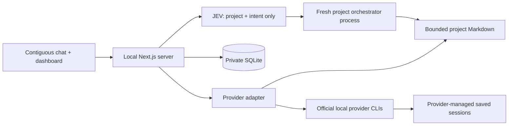

# crouter

**Your projects, one conversation.** An MIT-licensed, local-first agent router built with Next.js, React, TypeScript, Tailwind CSS, and SQLite. JEV selects a project and intent. A fresh, bounded project orchestrator handles each operation; Codex, Claude, Grok, Gemini, Antigravity, and Muse workers retain their own sessions through their official local CLIs.

## Quick start

Use Node.js **22.13+** (Node 24 recommended) and npm on macOS or Linux. SQLite is provided by Node, so no database server or native SQLite package is needed. The app is designed for a single trusted user on a local machine, not a public server or serverless platform.

```sh
npm ci
cp .env.example .env.local
```

Edit `.env.local` locally. Set `TYPESAFE_API_KEY` to your TypeSafe key. Keep the variable server-only; never add a `NEXT_PUBLIC_` prefix. For real use, put runtime data outside your source repositories:

```sh
# Run in your own terminal. This directory is private and must not be committed.
export CROUTER_DATA_DIR="$HOME/.local/share/crouter"
npm run dev
```

Open [http://127.0.0.1:3000](http://127.0.0.1:3000). Click **Add project**, enter a name and an absolute path to an existing project folder, and optionally add aliases. Registration creates `.router-agent/` in that folder and adds `/.router-agent/` to its `.gitignore`. Existing tracked agent state is rejected. Names and aliases must be unique; the registry holds at most 20 projects.

Each turn must explicitly name one project:

- `What is the status of Atlas?`
- `Create a task for Atlas: review the login flow and outline edge cases.`

Choose a provider in the composer for new tasks. ChatGPT uses Codex; `agy` is Antigravity CLI, with Gemini CLI offered separately. Open a queued task to start its worker, inspect the result, or resume its saved provider session. Chat history is purely a local display; asking “do that again” will not retrieve previous chat context.

## Official CLI subscription logins

Install the official [Codex CLI](https://learn.chatgpt.com/docs/cli) and [Claude Code](https://code.claude.com/docs/en/setup), then authenticate in your own terminal:

```sh
codex login
claude auth login
```

Use your subscription account when each CLI offers that login. The app does not read, copy, export, or manufacture authentication tokens, and does not set OpenAI or Anthropic API keys. Billing, subscription eligibility, and usage limits remain the provider's responsibility. `CODEX_BIN` and `CLAUDE_BIN` may point to trusted local executables. CLI detection in the UI checks installation only, not authentication. Grok’s local `grok login` and ACP adapter are covered in [docs/providers.md](docs/providers.md).

The adapters use current official CLI contracts:

- **Codex:** `codex exec --json`, `thread.started` session IDs, and `codex exec … resume <id> -`. Read-only sandbox and `never` approval policy apply on every new/resumed run. User configuration and execpolicy rules are skipped; saved CLI authentication is still used. See [non-interactive mode](https://learn.chatgpt.com/docs/non-interactive-mode).
- **Claude:** `claude -p --output-format stream-json --verbose`, `session_id`, and `--resume <id>`. Uses `--safe-mode`, no user/project/local settings sources, empty strict MCP configuration, and only `Read,Glob,Grep` tools with `dontAsk`. See [programmatic CLI usage](https://code.claude.com/docs/en/headless) and [CLI reference](https://code.claude.com/docs/en/cli-reference). Bare mode is deliberately not used because current Claude documentation says it requires API credentials rather than the subscription login.

Use recent CLI versions supporting these flags; incompatible versions fail closed. No bypass-permissions flag is used. Workers are **read-only planning and review agents** in this first version. “Done” means that worker turn produced its plan/findings, not that code was implemented. To implement a plan, open the saved session in the official interactive CLI in the correct project folder and explicitly review its tool permissions there. That separate interaction is outside the web app's approval system.

## Offline synthetic demo

The demo contains fabricated projects and task content. It makes no JEV calls and never starts a provider CLI. Run against a separate empty data directory:

```sh
CROUTER_DATA_DIR=/tmp/crouter-demo npm run demo
CROUTER_DATA_DIR=/tmp/crouter-demo CROUTER_DEMO=1 npm run dev
```

Remove `CROUTER_DEMO=1` and use a different data directory for real use. Demo routing is a deliberately simple name match, clearly labeled in the UI; production never silently falls back to it.

## Providers, usage, and private hosting

The main chat reports completion and failure of crouter worker turns across all projects. The conversation uses assistant-ui’s open-source external-store runtime without hosted cloud persistence. Codex quota windows come from its official local account interface; unsupported subscription metrics remain unavailable. Grok uses its official local ACP client. Gemini, Antigravity (`agy`), and Muse Code use an additional macOS filesystem barrier and fail closed on other platforms. ChatGPT is the Codex adapter. See [provider details](docs/providers.md) and [private Tailscale Serve setup](docs/tailscale.md).

## Architecture and data boundaries



**Global SQLite:** project ID/name/path/aliases, at most 200 display messages, short-lived single-use approval references, and expiring operation leases. It stores no task knowledge or project summaries. Dashboard task content is read from project files on demand. The default private data directory is `.crouter/`; prefer the external directory shown above.

**JEV:** a fresh server-side request to the official TypeSafe endpoint `POST https://api.typesafe.ai/v1/systemone`, with `Authorization: Bearer $TYPESAFE_API_KEY`, `model: jev-latest`, and two `choice` questions. Only the current turn and registry IDs/names/aliases are submitted. No paths, chat history, task files, decisions, or session IDs are included. Responses are validated against the allowed project and intent set, with a minimum confidence of 0.75. Missing credentials, network errors, invalid output, unknown intents, or ambiguity fail before any project work. See the [official TypeSafe quick start](https://docs.typesafe.ai/introduction/quickstart).

**Project orchestrators:** ordinary short-lived Node processes with no model session, network calls, or retained context. A process reads only the small fixed state files and, when needed, one requested task file; handles status/task creation/state updates; writes Markdown atomically; and exits. No project orchestrator memory accumulates between turns. They do not recursively scan repositories or load transcripts.

```text
project/
  .router-agent/              # private; ignored in that project's Git repository
    tasks.md                 # JSON metadata in Markdown: status, provider, session IDs
    decisions.md             # short, rolling operational decisions
    agents.md                # concise provider policy
    tasks/T-xxxxxxxx.md       # individual request and bounded latest result
    archive/                 # archived task files; not read during orchestration
```

There are at most **40 active tasks** per project; `tasks.md` is at most **32 KiB**; `agents.md`, `decisions.md`, and each task file are at most **8 KiB**. Results are capped, and operational decisions retain only the latest 24 entries. Oversized or malformed state fails rather than being silently loaded. Archive finished tasks to free space. Each provider has its own task/session binding; there is no automatic provider switching or `--last` session guessing.

**Workers:** each turn starts the official CLI process, resuming the recorded session when present. Fresh process execution and persistent provider conversations are separate lifecycles. The session identifier is saved immediately when observed, before the final response. Stderr/tool event bodies are not exposed in the UI; only bounded final text is persisted. Shell interpolation is never used. Workers receive a small environment allowlist, excluding JEV and other API-key variables. Provider-managed sessions live wherever their official CLI stores them, outside the app's database.

## Safe local setup

- Start with `npm run dev` or `npm start`; both bind to `127.0.0.1`. Keep the app on loopback. Private Tailscale Serve is supported only with the exact origin and identity allowlist in [docs/tailscale.md](docs/tailscale.md). Do not expose it with a public tunnel, generic reverse proxy, or `--hostname 0.0.0.0`; there is no multi-tenant authentication. If changing ports, set the exact loopback `CROUTER_ORIGIN`, such as `http://127.0.0.1:3001`.
- The API validates loopback Host values, exact Origin, JSON bodies, a same-origin custom header for mutations, request-size limits, input schemas, and project/task IDs. Cross-site requests and DNS-rebinding hosts are rejected. Browser output is rendered as plain text, without executing Markdown/HTML.
- Register only trusted, dedicated project folders. Root/home directories are refused; paths are canonicalized; agent directories and files cannot be symlinks. Runtime directories are created with `0700` permissions and database/state files with `0600` permissions where the platform supports them. This is defense in depth, not a sandbox against another process running as your own OS user.
- Read-only CLI permissions prevent repository modifications through the web worker. They do **not** guarantee that a provider cannot read private project content. Codex's sandbox is provider/platform-managed; Claude's file tools are not an OS sandbox. Use a dedicated account/container and sanitized worktree if filesystem confidentiality requires stronger isolation. Provider logins still send prompts and read context to their respective services. Local-first refers to storage and coordination, not fully offline inference.
- Task archival, removing a registry entry, and clearing chat require an explicit preview and confirm. Tokens expire after 60 seconds, are consumed once, and bind to the unchanged target. Archival preserves Markdown; unregistering never deletes the project. Running workers block archive/removal. Workers cannot request a destructive action via JEV.
- API errors never include raw upstream responses, authorization headers, CLI stderr, or stacks. A few recognizable token patterns and the routing key are redacted from final worker text, but automatic redaction is not a guarantee: keep secrets out of task requests and share no private screenshots or state.

## Publishing without private data

The root `.gitignore` excludes `.env*` except the empty `.env.example`, `.crouter/`, SQLite databases and journals, logs, personal CLI configuration/auth files, keys, and runtime `.router-agent/` directories. The **only** intentional agent-state exception is the explicitly synthetic fixture in `fixtures/project/`. Runtime registration also excludes agent state inside each registered project. Git ignore rules do not remove files that are already tracked and cannot protect files force-added later.

Before committing or publishing:

```sh
npm run privacy:check
npm run check
npm run build
git diff --cached --stat
git diff --cached
```

`privacy:check` inspects the **exact Git index contents** when Git is available, rejecting private runtime filenames, common key/token shapes, and personal home paths without printing matched values. In a new uninitialized workspace it scans publishable source files instead. It is a heuristic check, not a complete secret detector or Git-history audit. Also use your preferred secret scanner (for example Gitleaks) over the complete Git history before making an existing repository public. GitHub CI runs the privacy check, tests, and build without any API or subscription credentials. Never use real project state, paths, messages, or session IDs as test fixtures.

If a secret was committed, revoke/rotate it first, remove it from history, and verify all forks/copies as appropriate. Do not merely add an ignore rule. For bug reports, use the synthetic demo; never attach databases, `.env.local`, task state, or CLI authentication files. Review screenshots for private names and content.

## Development and recovery

```sh
npm run check        # strict TypeScript, ESLint, isolated state/security/provider tests
npm run build
npm start            # production server, still loopback
```

Tests use temporary synthetic projects and fake CLI processes; no account or network is required. Provider behavior is tested at the adapter boundary, not by spending subscription usage. Source is split into `app/api/` for local HTTP endpoints, `lib/server/` for routing/coordination/adapters, `scripts/` for fresh project processes, and `components/` for the interface.

SQLite WAL and expiring leases serialize project writes and prevent overlapping worker turns. A stopped/restarted server can leave a task marked running. Wait for its worker lease to expire (the configured worker timeout plus 15 seconds), verify that no old CLI process is still running, and use **Recover interrupted run** in task details. Then resume the saved thread. Timeout/output-limit failures kill the spawned process group on macOS/Linux and retain any captured ID. Concurrent state operations fail with a retryable conflict instead of overwriting one another. Backup private SQLite (using a proper SQLite backup while active) and project Markdown together; provider session data must be backed up separately according to the provider's tooling.

Windows process-tree isolation is not implemented in this release; use WSL. Archive is recoverable by moving the file back and restoring its index entry, while cleared display history requires a backup. No runtime data is encrypted by this app; use OS disk encryption and protect backups.

## Contributing

Contributions are welcome. Keep JEV restricted to project/intent classification, orchestration bounded and disposable, state local and small, provider authentication owned by official CLIs, and tests synthetic. See [CONTRIBUTING.md](CONTRIBUTING.md) and [SECURITY.md](SECURITY.md). Licensed under [MIT](LICENSE).
